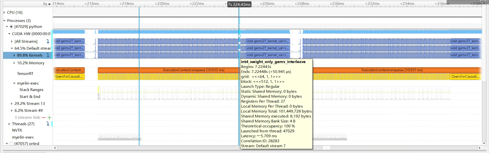

# TRT-LLM Qwen-7B

本工作是 [NVIDIA TensorRT Hackathon 2023](https://github.com/NVIDIA/trt-samples-for-hackathon-cn/tree/master/Hackathon2023) 的参赛题目，具体选题内容为 2+4 ，即用TensorRT-LLM实现新模型，并在本模型上启用现有feature或添加新feature。

本工作选用[Qwen-7B](https://github.com/QwenLM/Qwen-7B)模型作为待实现的新模型，通义千问-7B（Qwen-7B） 是阿里云研发的通义千问大模型系列的70亿参数规模的模型。Qwen-7B是基于Transformer的大语言模型, 在超大规模的预训练数据上进行训练得到，在Qwen-7B的基础上，还使用对齐机制打造了基于大语言模型的AI助手Qwen-7B-Chat。Qwen-7B支持8k的token长度，在多个全面评估自然语言理解与生成、数学运算解题、代码生成等能力的评测数据集上，均超出了同规模大语言模型的表现。

本工作将Qwen-7B模型移植至TensorRT LLM框架中，并开启了Int8和Int4的权重量化，在fp16精度下，相较启用了fast-attention的原版Qwen-7B transformers实现**1.946x**加速，Rouge精度相差在合理范围内；在int8权重量化下，相较启用了fast-attention的原版Qwen-7B transformers实现**2.754x**加速，Rouge精度相差在合理范围内；在int4量化下，实现**2.334x**加速，Rouge精度有一定损失，但速度、内存占用和引擎大小均大幅缩减，详细数据请参见优化效果部分。

具体模型构建和测试复现代码，请参考`tensorrt_llm_july-release-v1/examples/qwen/README.md`完成构建和运行

## 主要开发工作

### 开发工作的难点

本工作将Qwen-7B模型移植至TensorRT LLM框架中，并开启了Int8和Int4的权重量化。

该模型结构本身属于Decoder Only的大语言模型，TRT-LLM对其支持较好。Decoder Only的大语言模型具体结构都均为相似，区别主要在于Attention的细节和前后的MLP、Positional Embedding等。工程的核心难点在于从原始的Python文件中提取网络结构并将其对应到TRT-LLM的层中，如Rotary Embedding的实现在Qwen代码中是手动添加的，而在TRT-LLM中则与其他Attention一起通过GPT-Attention插件完成融合，此外，Qwen的Attention权重在qkv模块上有bias，而proj模块上则没有bias，TRT-LLM的Attention层则只能一并设置两者，因此需要从权重上进行处理实现等价计算。

工程实现过程中，使用了Debug功能来逐层分析比对输出误差，定位问题。同时在load权重时添加根据量化类型修改权重的功能，完成int8和int4精度下的weightonly的量化。

## 开发与优化过程

开发时，从原始的Qwen Python实现出发，逐步完成模型构建、引擎构建、引擎执行等过程。

### 模型构建

首先需要确认原始模型的结构。原始模型属于Decoder Only的大语言模型，整体结构分为embedding，循环的transformer块以及最后的head。其中循环的transformer块主要包括attention结构，其前后的Normlization函数以及mlp模型。此处列出一些可供参考的资料：关于Transformer结构的信息可以参考视频[https://www.youtube.com/watch?v=bCz4OMemCcA](https://www.youtube.com/watch?v=bCz4OMemCcA)，关于以llama为例的大语言模型里修改后的Transformer结构的信息可以参考视频[https://www.youtube.com/watch?v=Mn_9W1nCFLo](https://www.youtube.com/watch?v=Mn_9W1nCFLo)。下面的内容默认读者已经了解大语言模型中一些常见的技术和名词。

Qwen的模型整体和以llama为代表的大语言模型比较类似，其Normlization函数使用RmsNorm，而Attention的Positional Embedding采用Rotary Positional Embedding。Qwen的Attention模块在qkv部分上有bias，而proj部分上则没有bias。

TRT-LLM提供了大量工具帮助我们构建。在`tensorrt_llm_july-release-v1/tensorrt_llm/layers`目录中，包含了和torch中`nn.Module`类似的大语言模型中常用的TRT-LLM模块，而`tensorrt_llm_july-release-v1/tensorrt_llm/functional.py`文件中提供了类似`nn.functional`的函数式接口。

#### 代码对代码翻译

首先以`QwenMLP`为例，介绍基础的代码对代码的模型搭建方法，原始的`QwenMLP`代码如下

```py
class QWenMLP(nn.Module):
    def __init__(self, config):
        super().__init__()
        self.w1 = nn.Linear(
            config.hidden_size, config.intermediate_size // 2, bias=not config.no_bias
        )
        self.w2 = nn.Linear(
            config.hidden_size, config.intermediate_size // 2, bias=not config.no_bias
        )
        ff_dim_in = config.intermediate_size // 2
        self.c_proj = nn.Linear(ff_dim_in, config.hidden_size, bias=not config.no_bias)

    def forward(self, hidden_states):
        a1 = self.w1(hidden_states)
        a2 = self.w2(hidden_states)
        intermediate_parallel = a1 * F.silu(a2)
        output = self.c_proj(intermediate_parallel)
        return output
```

可以看到其中由3个线性层组成，而TRT-LLM中包含`ColumnLinear`这一可用于多卡并行环境的线性层，不难写出对应的TRT-LLM Module

```py
class QwenMLP(Module):
    def __init__(self,
                 hidden_size,
                 intermediate_size,
                 bias=False,
                 dtype=None,
                 tp_group=None,
                 tp_size=1):
        super().__init__()
        self.w1 = ColumnLinear(hidden_size,
                               intermediate_size // 2,
                               bias=bias,
                               dtype=dtype,
                               tp_group=tp_group,
                               tp_size=tp_size)
        self.w2 = ColumnLinear(hidden_size,
                               intermediate_size // 2,
                               bias=bias,
                               dtype=dtype,
                               tp_group=tp_group,
                               tp_size=tp_size)
        self.c_proj = ColumnLinear(intermediate_size // 2,
                                   hidden_size,
                                   bias=bias,
                                   dtype=dtype,
                                   tp_group=tp_group,
                                   tp_size=tp_size)

    def forward(self, hidden_states):
        a1 = self.w1(hidden_states)
        a2 = self.w2(hidden_states)
        intermediate_parallel = a1 * silu(a2)
        output = self.c_proj(intermediate_parallel)
        return output
```

#### 模块对模块的移植

同一功能有很多实现方法，这些实现方法相当复杂，可以考虑不用在代码层面上对齐而是在功能层面上对齐对于QwenAttention模块，注意到其功能较为复杂。但是经过查阅Qwen的[技术文档](https://github.com/QwenLM/Qwen-7B/blob/main/tech_memo.md)，以及观察原始代码中对Flash Attention的调用，可以确定其完成的Attention内部并没有进行特殊处理，可以直接使用TRT-LLM的Attention替换。此时，需要确定对应的调用参数，这就需要熟读两个框架对应的代码，确定其语义具体的选项。Qwen模型的一些配置也可以在`tensorrt_llm_july-release-v1/examples/qwen/Qwen-7B/config.json`中找到。

模块对模块的移植要编写的代码量很少，也能更好利用TRT-LLM提供的高效实现。但却要求对代码有更高的掌握，如上文提到的QwenAttention模块，在具体移植时还涉及模型外部Positional Embedding与Attention的交互，而TRT-LLM中这些交互在Attention内部完成，相应代码也需要加以修改。

移植完成后，将模型文件放到`tensorrt_llm_july-release-v1/tensorrt_llm/models/qwen`文件夹中，并在相关`__init__.py`中完成import，即可在python中调用相关函数。

note: 注意pip默认会将python文件安装到自己的目录下，所以在源代码中修改完之后需要重新安装，或者也可以使用develop安装方式`pip install -e`

### 引擎构建

引擎构建时，需要从加载模型文件，加载对应的权重，配置相关选项，并最终调用TRT-LLM构建生成引擎文件。这部分内容可以参考`tensorrt_llm_july-release-v1/examples/qwen/build.py`

TRT-LLM针对多卡场景进行优化，允许多个线程加载引擎并合作推理，这部分操作主要在权重加载时完成。此外，TRT-LLM支持Int8和Int4 WeighOnly的量化，同样需要在加载权重时完成，这部分内容可以参考`tensorrt_llm_july-release-v1/examples/qwen/build.py`

具体的权重加载过程涉及找到HF权重对应的TRT-LLM模型Parameter，并且针对多卡推理和量化对权重加以处理。以Attention模块为例，HF权重包括`attn.c_attn.weight`，`attn.c_attn.bias`和`attn.c_proj.weight`，对应的时模型的`attention.qkv.weight`，`attention.qkv.bias`和`attention.dense.weight`，使用以下代码完成赋值

```py
dst = tensorrt_llm_qwen.layers[idx].attn.qkv.weight
dst.value = np.ascontiguousarray(split_v)
```

对多卡的支持则是通过对权重分割完成的，以Attention模块为例，按`tensor_parallel`对权重进行划分

```py
q_emb = v.shape[0] // 3
model_emb = v.shape[1]
v = v.reshape(3, q_emb, model_emb)
split_v = split(v, tensor_parallel, rank, dim=1)
split_v = split_v.reshape(3 * (q_emb // tensor_parallel), model_emb)
```

对量化的支持则是调用了`torch.ops.fastertransformer.symmetric_quantize_last_axis_of_batched_matrix`进行了逐通道的对称量化，并设置了量化后权重和scale，以Attention模块为例

```py
if use_weight_only:
    v = np.ascontiguousarray(split_v.transpose())
    processed_torch_weights, torch_weight_scales = torch.ops.fastertransformer.symmetric_quantize_last_axis_of_batched_matrix(
        torch.tensor(v), plugin_weight_only_quant_type)
    # workaround for trt not supporting int8 inputs in plugins currently
    dst.value = processed_torch_weights.view(
        dtype=torch.float32).numpy()
    scales = tensorrt_llm_qwen.layers[idx].attn.qkv.per_channel_scale
    scales.value = torch_weight_scales.numpy()
else:
    dst.value = np.ascontiguousarray(split_v)
```

注意，对于未设置的Parameter，TRT-LLM可能会用未初始化的空间进行计算，因此对于Qwen模型Attention中没有bias的部分手动设置bias为0

### 引擎执行

可以参考`tensorrt_llm_july-release-v1/examples/qwen/run.py`和`tensorrt_llm_july-release-v1/examples/qwen/summarize.py`

Qwen模型使用了自己独特的Tokenizer，所以需要在Python中加载Tokernizer并完成Tokernize过程。此后设置好`ModelConfig`和`SamplingConfig`，读取序列化后的引擎，即可使用`tensorrt_llm.runtime.GenerationSession`接口创建一个推理Session，此后调用`decode`函数即可启动推理

## 优化效果

### 实验环境

- 阿里云虚拟机环境
- CPU: Intel(R) Xeon(R) Platinum 8369B CPU @ 2.90GHz 16核心
- GPU: NVIDIA A10 GPU 24GB
- 内存：64GB
- 操作系统: Ubuntu 20.04.5 LTS
- CUDA版本: 12.1
- CUDA驱动版本: 525.105.17

### 性能及精度指标

在CNN Dailymail数据集上完成Summarize任务并使用 [Rouge](https://huggingface.co/spaces/evaluate-metric/rouge) 来对比模型优化前后的精度差距。

hf原版实现CNN Dailymail数据集上的Summary任务指标

```
[09/19/2023-16:28:24] [TRT-LLM] [I] Hugging Face (total latency: 63.0036199092865 sec)
[09/19/2023-16:28:24] [TRT-LLM] [I] HF beam 0 result
[09/19/2023-16:28:24] [TRT-LLM] [I]   rouge1 : 23.542276175618408
[09/19/2023-16:28:24] [TRT-LLM] [I]   rouge2 : 8.298578499008089
[09/19/2023-16:28:24] [TRT-LLM] [I]   rougeL : 18.020127809419513
[09/19/2023-16:28:24] [TRT-LLM] [I]   rougeLsum : 19.067740468195073
```

trt llm在CNN Dailymail数据集上的Summary任务指标，采用FP16精度，对应加速比为1.946x，精度误差在合理范围内，GPU显存占用20.249GB，引擎大小16.0GB

```
[09/19/2023-16:35:33] [TRT-LLM] [I] TensorRT-LLM (total latency: 32.374117851257324 sec)
[09/19/2023-16:35:33] [TRT-LLM] [I] TensorRT-LLM beam 0 result
[09/19/2023-16:35:33] [TRT-LLM] [I]   rouge1 : 25.43300079943117
[09/19/2023-16:35:33] [TRT-LLM] [I]   rouge2 : 9.06443649019336
[09/19/2023-16:35:33] [TRT-LLM] [I]   rougeL : 19.480772591016652
[09/19/2023-16:35:33] [TRT-LLM] [I]   rougeLsum : 20.84898295493978
```

trt llm在CNN Dailymail数据集上的Summary任务指标，采用Int8 WeightOnly量化，对应加速比为2.754x，精度误差在合理范围内，运行时显存占用13.557GB，引擎大小8.4GB

```
[09/20/2023-06:44:54] [TRT-LLM] [I] TensorRT-LLM (total latency: 22.8713800907135 sec)
[09/20/2023-06:44:54] [TRT-LLM] [I] TensorRT-LLM beam 0 result
[09/20/2023-06:44:55] [TRT-LLM] [I]   rouge1 : 23.90645420218702
[09/20/2023-06:44:55] [TRT-LLM] [I]   rouge2 : 7.891516095599542
[09/20/2023-06:44:55] [TRT-LLM] [I]   rougeL : 17.593275690274655
[09/20/2023-06:44:55] [TRT-LLM] [I]   rougeLsum : 19.91946017932637
```

trt llm在CNN Dailymail数据集上的Summary任务指标，采用Int4 WeightOnly量化，对应加速比为2.334x，精度存在一定误差，运行时显存占用10.542GB，引擎大小5.4GB

```
[09/20/2023-07:02:53] [TRT-LLM] [I] TensorRT-LLM (total latency: 26.977251052856445 sec)
[09/20/2023-07:02:53] [TRT-LLM] [I] TensorRT-LLM beam 0 result
[09/20/2023-07:02:53] [TRT-LLM] [I]   rouge1 : 23.70251298379219
[09/20/2023-07:02:53] [TRT-LLM] [I]   rouge2 : 7.016004368646156
[09/20/2023-07:02:53] [TRT-LLM] [I]   rougeL : 18.027980286289
[09/20/2023-07:02:53] [TRT-LLM] [I]   rougeLsum : 21.013849142346537
```

相关测试代码均包含在本仓库中。

#### 测试结果分析

从测试结果中我们发现，int4 weightonly量化的性能并不如int8。从int4到int8 weightonly量化的性能收益是减少了一半的Global Mem读取，性能开销则来自于因为没有int4计算硬件带来的转换开销。虽然如此，在我们启用了KV-Cache的情况下，大语言模型的推理任务应当是Memory Bound为主导，不应该出现这样的性能下降，因此我们使用Nsight System进行分析。




可以看到如图所示，在单个Token的推理过程中，int4 weightonly量化的性能(10.933ms)其实高于int8 weightonly量化(16.991ms)，也就是说，性能的差距并不在这里。综合考虑之下，其性能差距很可能是来源于推理次数，而不是推理轮数的增加。

修改Python代码，统计各种推理方案下输出Token数，结果如下：

- hf原版输出长度：1463
- fp16精度输出长度：797
- int8量化后输出长度：932
- int4量化后输出长度：1706

通过上述统计以及对输出的分析，可以发现int4量化后模型不能很好的总结相应内容，会输出一些无意义token，模型的能力受到了量化较大影响，模型输出长度增加，迭代轮数增多，导致最终性能反而下降。

受限于时间因素，我们没能很好地解决这一问题，这一问题可以从两个方面入手解决。一方面可以使用smooth quant等技术降低量化地难度，另一方面也可以通过使用PTQ或直接使用裁剪好的int4参数。Qwen7B基座模型本身没有int4权重，但其chat版本Qwen-7B-chat提供了一个int4版本的权重。然而Qwen7B模型目前暂时从HuggingFace下线，我们没有来得及尝试使用这些方案。此外，在原生支持int4计算的设备上，单轮推理性能提升的收益可能能超过其导致的模型能力下降带来的迭代数增加的损失。

### 送分题答案

1. 请在报告中写出 /root/workspace/tensorrt_llm_july-release-v1/examples/gpt/README 里面 “Single node, single GPU” 部分如下命令的输出（10分）模型为gpt2-medium

输出结果为：

```
Input: Born in north-east France, Soyer trained as a
Output:  chef and eventually became a chef at a
```


2. 请在报告中写出 /root/workspace/tensorrt_llm_july-release-v1/examples/gpt/README 里面 “Summarization using the GPT model” 部分如下命令的rouge 分数（10分）模型为gpt2-medium

Rogue分数为：

```
[09/11/2023-06:01:32] [TRT-LLM] [I]   rouge1 : 21.869322054781037
[09/11/2023-06:01:32] [TRT-LLM] [I]   rouge2 : 6.258925475911645
[09/11/2023-06:01:32] [TRT-LLM] [I]   rougeL : 16.755771650012953
[09/11/2023-06:01:32] [TRT-LLM] [I]   rougeLsum : 18.68034777724496
```


### 经验与体会（可选）

深度学习模型加速是一个重要的研究方向，NVIDIA作为其早期入场者有着丰厚的经验积累，TRT-LLM作为其专门针对大语言模型推理加速的解决方案，包含了许多开箱即用的工具。尽管因为还处于Early Access版本，其效果也毋庸置疑。比赛中没能实验多卡和inflight batching是一个比较遗憾的点。大语言模型有独特的问题，传统的推理加速并不能解决全部，如何更好的Serve才是值得关注的重点。本次比赛期间团队成员个人事务均较多，没能完全体会TRT-LLM的所有功能。TRT-LLM目前还在扩充自己支持的模型和功能，希望将来能有更多机会实验及使用。